# The Trajectory Trace: A Cybernetic Journal

*A procedural, material-conceptual apparatus for the holographic projection of drift, temporal bifurcation, and posthuman attunement.*

```mermaid
graph TD
    subgraph VP [Aion: The Virtual]
        A[Lines of Flight] --> B[Attractor Basins]
        B --> C[Reservoir of Potentials]
    end
    subgraph MA [Chronos: The Actual]
        D[Linear Tasks / Milestones] --> E[Evening Diagnostics]
        E --> F[SQLite / Physical Database]
    end
    subgraph JI [Agential Cut]
        G[Left Page: Morning Attunement] <--> H[Right Page: Evening Inscription]
    end
    VP <-->|Intra-active Feedback| JI
    JI <-->|Diffractive Mapping| MA
    style JI fill:#0f172a,stroke:#38bdf8,stroke-width:2px
```

---

## Introduction: Against the Domesticated Page

The modern planner is a capitalist machine of capture. It treats time as a sterile, empty container to be carved up, optimized, and sold back to the laboring subject. It demands that we register our presence only as a unit of output, domesticating our attention into linear grids of task-completion.

**The Trajectory Trace** is a refusal of this domestication. It is not a tool for retrospective self-documentation or a metric tracking device. It is a **performative apparatus of physical-conceptual measurement**—a material-discursive interface designed to enact daily "agential cuts" within our cognitive, creative, and somatic state-spaces.

Grounded in Karen Barad’s *agential realism*, Gilles Deleuze’s temporal ontology, and Gordon Pask’s *Conversation Theory*, this apparatus operates as a structural coupling device between human attention, computational topology, and physical paper.

---

## I. From Productivity to Spacetimemattering

Traditional journals encourage *reflection*—a metaphor of mirroring that assumes a separation between the writer and the visual record, replicating the same representationalist geometries. This apparatus enforces **diffraction**: a physical metaphor of wave interference.

```mermaid
graph TD
    subgraph RM [Traditional Paradigm]
        A[User: Independent Observer] --> B(Mirror: Page) --> C[Reflection: Passive Record]
    end
    subgraph DI [The Trajectory Trace]
        D[User] <-->|Intra-Active Cut: Ink on Paper| E[The Material Page]
        E --> F[Interference Pattern: Diffracted State]
    end
    style E fill:#0f172a,stroke:#38bdf8,stroke-width:1px
    style F fill:#0f172a,stroke:#10b981,stroke-width:1px
```

In Barad’s agential realism, space, time, and matter are not pre-existing coordinates; they are continuously co-constituted through *intra-active* practices—a process termed **spacetimemattering**. 

By committing ink to the physical page, we do not record a pre-existing state; we perform an **agential cut** that stabilizes a temporary set of coordinates (attractors, stabilizers, flight lines, and resistors) out of a fluid field of virtual potential. 

The paper itself is a material participant in this process—its texture, boundary, and layout constrain and enable specific forms of thought. We are not "tracking our day"; we are diffracting our life through a structured, cybernetic grid to see what interference patterns emerge.

---

## II. The Thermodynamic Boundary: The 230-Page Limit

In digital systems, space is cheap, infinite, and virtual. It encourages a form of informational hoarding—limitless files, endless scrollback, and unconstrained logs that degrade attention into noise. 

The physical book resists this through its **thermodynamic materiality**. A bound book is a closed, crystalline structure governed by the physics of paper and thread.

Our procedural generation pipeline compiles the journal to fit **exactly 230 pages**. This page budget is not a technical hurdle to be bypassed; it is a **hard systemic boundary**. It represents the thermodynamic limit of the apparatus. 

Knowing that the system has a finite capacity of 84 days, partitioned into 3 cycles of 28 days with structured weekly folds and 28-day calibrations, forces a profound intentionality. Every page is a scarce resource; every ink-stroke is a permanent alteration of the physical substrate. The page limit forces us to confront the physical reality of our cognitive storage, transforming the apparatus into a dense, high-potency record of our systemic trajectory.

---

## III. The Holographic Fold: 8 Operators, 16 Dimensions

A fundamental challenge in cybernetic systems is the **cognitive bandwidth bottleneck of the human substrate**. Asking us to manually calculate, map, and write down 16 distinct, high-dimensional coordinate values twice a day introduces cognitive fatigue, which destroys the autopoietic flow of our writing practice.

To resolve this, the Trajectory Trace uses a **holographic projection**. The physical interface presents a low-dimensional control panel of **8 daily operational variables**, which act as "generative operators" that project directly onto a **16-dimensional structural manifold** within our backend engine:

```mermaid
graph TD
    subgraph HI [8 Operational Operators]
        O1[A1: Attractor] --- O2[S1: Stabilizer]
        O3[F1: Flight] --- O4[R1: Resistance]
        O5[V1: Vitality] --- O6[D1: Diffraction]
        O7[C1: Chronos] --- O8[A2: Aion]
    end
    
    subgraph PM [Projection Layer]
        W[16D Manifold Projection Matrix]
    end

    subgraph SS [16D Computational Space]
        S1[Homeostatic s01]
        S2[Amplifying s02]
        S3[Cyclic s03]
        S4[Bifurcated s04]
        S5[Decentralized s05]
        S6[Rhizomatic s06]
        S7[Boundary Perm. s07]
        S8[Recursion Depth s08]
        S9[Variety Filtering s09]
        S10[Negentropic Comp. s10]
        S11[Temporal Latency s11]
        S12[Attractor Depth s12]
        S13[Symbiotic s13]
        S14[Nomadic s14]
        S15[Co-Orientation s15]
        S16[Substrate Mater. s16]
    end

    O1 & O2 & O3 & O4 & O5 & O6 & O7 & O8 --> W
    W --> SS
    
    style HI fill:#0f172a,stroke:#38bdf8,stroke-width:1px
    style PM fill:#0f172a,stroke:#10b981,stroke-width:1px
    style SS fill:#0f172a,stroke:#a78bfa,stroke-width:1px
```

The 8 variables are organized as four conjugate pairs, representing the fundamental tensions of any open cybernetic system:
1.  **$A_1$ (Attractor) $\leftrightarrow$ $S_1$ (Stabilizer):** The tension between what pulls the system forward (gravitational focus) and what keeps it stable (homeostasis).
2.  **$F_1$ (Flight) $\leftrightarrow$ $R_1$ (Resistor):** The balance between the drive to mutate (deterritorialization) and the thermodynamic friction of the environment (drag).
3.  **$V_1$ (Vitality) $\leftrightarrow$ $D_1$ (Diffraction):** The relationship between raw creative energy (joy) and its manifestation through different projects and interference patterns.
4.  **$C_1$ (Chronos) $\leftrightarrow$ $A_2$ (Aion):** The division between structured, linear time (logistics) and open-ended, virtual exploration (drift).

When we write down these 8 numbers in the physical apparatus, we are intra-acting with the underlying 16-dimensional system in its *folded* state. The backend engine unfolds these metrics, calculating how they interfere to shape complex structural topologies like **Rhizomatic Flow**, **Boundary Permeability**, and **Negentropic Complexity**.

---

## IV. The Procedural Pipeline

The code in this repository is the compiler for this apparatus. By decoupling the visual templates, system configurations, and compilation logic, the pipeline becomes a highly customizable, generative architecture.

```mermaid
graph LR
    config[config.json] --> gen[generate_journal.py]
    content[journal_content.json] --> gen
    templates[templates/*.typ] --> gen
    gen -->|Decoupled Generation| compiled[renders/compiled_journal.typ]
    compiled -->|Embedded Typst Compiler| pdf[renders/compiled_journal.pdf]
    
    style gen fill:#0f172a,stroke:#38bdf8,stroke-width:1px
    style compiled fill:#0f172a,stroke:#10b981,stroke-width:1px
    style pdf fill:#0f172a,stroke:#a78bfa,stroke-width:2px
```

### Structure of the Repository

*   `config.json`: The master configuration file. Defines the page budget, fonts, margins, and cycle parameters (84 days, 28 days per cycle, target page size, etc.).
*   `journal_content.json`: Inscription content strings, baseline prompts, daily coordinates, and guides.
*   `generate_journal.py`: The Python orchestrator. It reads the configuration, calculates the exact mathematical sequence of pages, inserts the weekly folds and 28-day calibrations at their precise signature boundaries, and generates the master Typst document.
*   `templates/`: A collection of modular Typst files containing the visual layouts:
    *   `common.typ`: Shared styling, fonts (EB Garamond & JetBrains Mono), line weights, and the procedural $5\text{mm}$ background dot-grid.
    *   `title.typ`: System initialization and entropy baseline.
    *   `daily_left.typ`: The Morning Attunement page, featuring the Vector Force Field calculation block:
        $$\vec{F}_{\text{net}} = \left( \vec{F}_{\text{attractor}} + \vec{F}_{\text{flight}} \right) - \left( \vec{F}_{\text{stabilizer}} + \vec{F}_{\text{resistor}} \right)$$
    *   `daily_right.typ`: The Operational Console (Chronos/Aion split) and the Evening Diagnostic (State Grid, Entanglement Audit, and Diffraction Pattern).
    *   `weekly_left.typ` & `weekly_right.typ`: The Weekly Fold, providing a dedicated space for mapping wave interferences and compiling the weekly structural signature.
    *   `calibration_left.typ` & `calibration_right.typ`: The 28-Day Meta-Systemic Calibration page for attractor decay analysis and friction tuning.

---

## V. Epilogue: Inscribing the Cut

To write within this apparatus is to enter into a symbiotic relationship with a physical object. The pipeline compiles the PDF; the paper and thread hold the structure; our hand provides the ink.

1.  **Configure:** We edit `config.json` to define our target cycle length, signature constraints, and typography.
2.  **Generate:** We run `python generate_journal.py` (or `uv run generate_journal.py`) to compile our customized structure.
3.  **Print & Bind:** We print the generated PDF double-sided on high-quality cream paper ($120\text{gsm}$ is recommended to prevent ink bleed) and bind the sheets using a thread-sewn method to ensure they lie flat.
4.  **Inscribe:** Every morning, we calculate our vector forces. Every evening, we audit our entanglements. Let the ink settle. Let the trajectory trace map our drift.

---

*   [**Setup & Generation Guide** (docs/setup.md)](./docs/setup.md)
*   [**Customization & Design Guide** (docs/edit.md)](./docs/edit.md)
*   [**Structural Layout Outline** (docs/journal_outline.md)](./docs/journal_outline.md)
