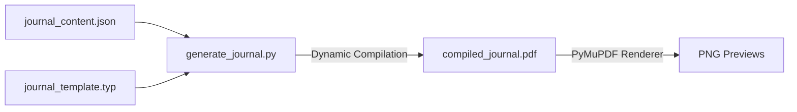

# Implementation Plan: Programmatic Journal Generation

This plan outlines the implementation steps to programmatically generate the 100-Day Cybernetic Journal PDF (exactly 240 pages, 3 cycles of 93 days) using a Python generator and Typst layout templates, separating content text into an editable JSON file.

---

## I. Architecture Overview

To maintain clean separation of concerns, the project will consist of three core components:



1. **`journal_content.json` (The Content Database):** Holds all human-readable text, instructions, taxonomy descriptions, challenge titles, and custom prompts.
2. **`generate_journal.py` (The Layout Assembly Script):** Loads the JSON data, calculates the exact pagination mapping to enforce the 240-page signature budget, constructs the dynamic Typst file, and compiles it.
3. **`journal_template.typ` (Typst Stylesheet):** Contains core layout definitions (margins, dot grid underlays, typographic parameters, and modular spread macros).

---

## II. Component Specifications

### 1. The Content Database (`journal_content.json`)
Allows modifying text prompts, taxonomy labels, and operating guides without editing script code.

```json
{
  "system_metadata": {
    "title": "CYBERNETIC JOURNAL",
    "subtitle": "An Apparatus of Autopoietic Stabilization and Temporal Bifurcation",
    "version": "v1.0.0"
  },
  "guide_text": {
    "manifesto": "Operating rules, smooth/striated time paradigms, and cybernetic feedback guidelines...",
    "taxonomy": {
      "dimensions": [
        {"id": "V1", "name": "Vigour", "description": "Subjective energetic vitality level..."},
        {"id": "T1", "name": "Temporal Drift", "description": "Ratio of Smooth vs. Striated activities..."}
      ]
    }
  },
  "calibration_prompts": {
    "cycle_1": {
      "title": "CYCLE 1: DETERRITORIALIZATION",
      "guideline": "Identify constraints to break, redundant structures, and external dependencies.",
      "prompts": ["Obsolete Attractors:", "Stagnant Habits to Deterritorialize:"]
    },
    "cycle_2": {
      "title": "CYCLE 2: RE-ORGANIZATION",
      "guideline": "Construct emergent workflows, test stabilizers, and regulate system temperature.",
      "prompts": ["Emergent Attractors:", "Workflow Adjustments:"]
    },
    "cycle_3": {
      "title": "CYCLE 3: STABILIZATION",
      "guideline": "Lock down homeostatic boundaries, secure routines, and establish negative feedback loops.",
      "prompts": ["Anchor Routines:", "Defensive Boundaries:"]
    }
  },
  "challenge_trackers": [
    {"id": "CH1", "title": "SCREEN-FREE EVENINGS", "target": "30 DAYS"},
    {"id": "CH2", "title": "CIRCADIAN LOCK", "target": "30 DAYS"},
    {"id": "CH3", "title": "INTENSIVE DRIFT RESEARCH", "target": "30 DAYS"},
    {"id": "CH4", "title": "PHYSICAL MOVEMENT", "target": "30 DAYS"},
    {"id": "CH5", "title": "MATERIAL ALLY CLEANSING", "target": "30 DAYS"},
    {"id": "CH6", "title": "DE-PLUG PROTOCOL", "target": "30 DAYS"}
  ]
}
```

### 2. Typost Stylesheet (`journal_template.typ`)
Enforces geometric precision:
* **Geometry:** A5 trim, double-sided margins (20mm inner gutter for Smyth-sewn flatness, 15mm outer margin).
* **Underlay Grid:** Subtle 5mm dot grid underlay built using Typst's canvas/patterns feature, with a light opacity ($12\%$).
* **Typographic System:** EB Garamond (prose/serif) and JetBrains Mono (monospaced data labels).
* **Grid Tracker Layouts:** Vector coordinate grids and terminal-style challenge trackers defined as reusable Typst functions.

### 3. Generator Assembly Script (`generate_journal.py`)
Computes pagination budget to fit **exactly 240 pages** (15 signatures of 16 pages).

```python
# Pseudo-logic for page distribution:
# 1. Output setup files (Title, manual, baseline) -> Pages 1-10
# 2. Iterate Cycles 1 to 3 (Pages 11-226):
#    - For each cycle:
#      - Append Calibration spread (2 pages)
#      - For weeks 1 to 4:
#        - Append Weekly Fold (2 pages)
#        - Append 7 Daily Spreads (14 pages)
#      - Append Transition spreads (3 daily spreads = 6 pages)
# 3. Append Challenge Trackers (2 pages * 3 blocks each = 6 blocks total) -> Pages 227-230
# 4. Append Absolute Diagnostics & Sketchpads -> Pages 231-240
```

---

## III. Step-by-Step Execution Plan

### Step 1: Content Definition
* Create `journal_content.json` containing the finalized manuals, prompt names, challenge trackers, and taxonomy references.

### Step 2: Typst Layout Styling
* Establish `journal_template.typ` with standard double-sided layouts, margins, dot-grid decorators, coordinate system renderers, and ASCII challenge blocks.

### Step 3: Python Generator Implementation
* Write `generate_journal.py` to:
  1. Load `journal_content.json`.
  2. Synthesize Typst strings programmatically.
  3. Compile using python-`typst` package wrapper.

### Step 4: Visual Preview Verification
* Add a step in `generate_journal.py` to use `fitz` (PyMuPDF) to render preview images of key spreads (Title page, Daily Spread, Weekly Fold, Calibration Setup, and Challenge Tracker) to check margins and spacing.

---

## IV. Preview Verification Metrics
Before printing, we will audit the rendered layouts for the following:
* **Gutter Safety:** Text elements do not sit within the 20mm inner binding zone.
* **Typographic Contrast:** JetBrains Mono and EB Garamond scale matches exactly.
* **Line Heights:** Space for physical writing sits at 6.35mm (standard college ruled spacing) to accommodate normal handwriting size on A5 pages.
* **Signature Alignment:** Total output page count is confirmed to be exactly 240 pages.
