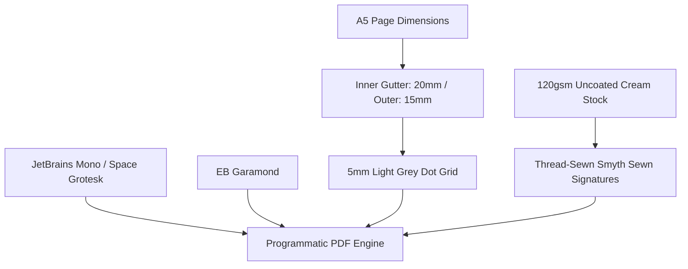

# Architectural Blueprint: The 84-Day Cybernetic Journal

*This document provides the definitive structural outline, template designs, and philosophical-cybernetic justifications for our physical, A5-format 84-Day Cybernetic Journal. This layout serves as the official specification for the programmatic PDF generation phase.*

---

## I. Philosophical & Systemic Architecture

The apparatus operates as a **performative apparatus of physical-conceptual measurement** (agential realism) rather than a passive notebook. It aims to restructure cognitive patterns, regulate systemic energy, and balance stability (homeostasis) with adaptive mutation (homeorhesis).

```mermaid
flowchart TD
    subgraph VP ["Aion: The Virtual"]
        A["Lines of Flight"] --> B["Attractor Basins"]
        B --> C["Reservoir of Potentials"]
    end
    subgraph MA ["Chronos: The Actual"]
        D["Linear Tasks / Milestones"] --> E["Evening Diagnostics"]
        E --> F["Inscribed Physical Trace"]
    end
    subgraph JI ["Agential Cut"]
        G["Left Page: Morning Attunement"] <--> H["Right Page: Evening Inscription"]
    end
    C <-->|Intra-active Feedback| G
    H <-->|Diffractive Mapping| E
    style JI fill:#0f172a,stroke:#38bdf8,stroke-width:2px
```



### 1. Baradian Spacetimemattering
In Karen Barad's framework, time, space, and matter are not pre-existing entities but are continuously co-constituted through *intra-active* practices. Writing is a physical process that draws an **agential cut**—separating observer and observed. The apparatus does not record a static day; writing within it actively materializes the day’s boundary, turning fleeting thoughts into a physical trace on uncoated cream paper.

### 2. Temporal Bifurcation: Chronos vs. Aion
*   **Chronos (Striated / Linear):** The time of clock-ticks, structured schedules, appointments, and task completion.
*   **Aion (Smooth / Intensive):** The floating time of the event, creative play, open research, and conceptual drift.
By dividing the task fields, we prevent the administrative demands of Chronos from crowding out the creative potential of Aion.

### 3. Diffractive Interference
Instead of simple mirroring (reflection), the apparatus acts as a **diffraction grating**. Through the Weekly Folds, we trace how waves of attention, stress, sleep, and environment interfere with one another, mapping out constructive or destructive patterns.

---

## II. Master Page Map (230 Pages)

To satisfy our physical page budget constraints, the apparatus contains exactly **230 pages**. It is structured around **3 cycles** of 28 days each (84 total tracking days), leaving room for setup guidelines, macro taxonomies, challenge trackers, and absolute diagnostic matrices.

### Structural Rule:
1. **Cycle Setup Calibration:** A 2-page calibration spread initializes the rules, metrics, and parameters at the *beginning* of each cycle.
2. **Weekly Fold:** A 2-page fold runs at the *beginning* of each week, serving as a setup, focus selector, and diffraction layout prior to the 7 daily spreads.
3. **Daily Spreads:** Each day consists of a two-page spread (Left: Morning, Right: Evening).

| Page Range | Section / Template Type | Operational Purpose | Temporal Scale |
| :--- | :--- | :--- | :--- |
| **Page 1** | Front Page / Title Page | Title, system initialization parameters, operator credentials. | Day 0 |
| **Page 2** | Blank Page | Secondary cover buffer. | Day 0 |
| **Page 3** | System State Baseline | Baseline structural indices and ownership log. | Day 0 |
| **Pages 4–7** | Operating Guidelines | Guides explaining the Vector Force Field, Chronos/Aion split, and diagnostic loops. | Epochal |
| **Pages 8–9** | 16-Dimensional Taxonomy Reference | Legend, coordinates, and definitions of the structural state dimensions. | Epochal |
| **Pages 10–13** | Stratification Spreads | Somatic baselines, allies, vector space, and intent mapping. | Day 0 Setup |
| **Pages 14–79** | **Cycle 1: Days 1–28 (Deterritorialization)** | First systemic iteration of daily, weekly, and meta-systemic loops. | 28-Day Cycle |
| *Pages 14–15* | Cycle 1 Calibration (Setup) | Initialize cycle-level parameters and friction tuning targets. | 28-Day Setup |
| *Pages 16–17* | Weekly Fold 1 (Diffraction Space) | Weekly calibration, macros, and diffraction interference audit. | Weekly Setup |
| *Pages 18–31* | Week 1: Days 1–7 | 7 consecutive daily spreads (Left: Morning, Right: Evening). | Daily |
| *Pages 32–33* | Weekly Fold 2 (Diffraction Space) | Weekly calibration. | Weekly Setup |
| *Pages 34–47* | Week 2: Days 8–14 | 7 consecutive daily spreads. | Daily |
| *Pages 48–49* | Weekly Fold 3 (Diffraction Space) | Weekly calibration. | Weekly Setup |
| *Pages 50–63* | Week 3: Days 15–21 | 7 consecutive daily spreads. | Daily |
| *Pages 64–65* | Weekly Fold 4 (Diffraction Space) | Weekly calibration. | Weekly Setup |
| *Pages 66–79* | Week 4: Days 22–28 | 7 consecutive daily spreads. | Daily |
| **Pages 80–145** | **Cycle 2: Days 29–56 (Re-organization)** | Second systemic iteration. | 28-Day Cycle |
| *Pages 80–81* | Cycle 2 Calibration (Setup) | Initialize parameters and set development goals for Cycle 2. | 28-Day Setup |
| *Pages 82–145* | Weeks 5–8 (Daily Spreads & Folds) | 4 alternating blocks of [Weekly Fold (2 pages) + 7 Daily Spreads (14 pages)]. | Weekly / Daily |
| **Pages 146–211** | **Cycle 3: Days 57–84 (Stabilization)** | Third systemic iteration. | 28-Day Cycle |
| *Pages 146–147* | Cycle 3 Calibration (Setup) | Initialize parameters and set development goals for Cycle 3. | 28-Day Setup |
| *Pages 148–211* | Weeks 9–12 (Daily Spreads & Folds) | 4 alternating blocks of [Weekly Fold (2 pages) + 7 Daily Spreads (14 pages)]. | Weekly / Daily |
| **Pages 212–213** | Challenge Trackers | Visual terminal-style grid trackers for habit challenges (Challenges 1–6). | 28-Day Grid |
| **Pages 214–215** | Trajectory Mapping & Analysis | Tracing the full 84-day vector trajectory and 16D state vectors consolidation. | Long-Term |
| **Pages 216–217** | Topological Left & Right | Global topological mapping grids. | Long-Term |
| **Pages 218–219** | Autopoietic Diagnostics | Diagnostic coordinate summaries and system telemetry charts. | Long-Term |
| **Pages 220–228** | Sketchpads | Free-form schematic mapping and notes. | Long-Term |
| **Page 229** | Blank Page | Back of cover buffer. | Day 85 |
| **Page 230** | System Shutdown / End Page | Final system diagnostic summary and closure stamp. | Day 85 |

---

## III. Detailed Template Visualizations

To avoid visual clutter and maintain a premium aesthetic, daily spreads contain only structural lines and minimal, short reminders. In-depth instructions are relegated to the Operating Guide at the front of the apparatus.

### 1. The Daily Spread

#### Left Page: Morning Attunement (The Virtual Field)
```
================================================================================
DAY [ ___ / 84 ]   DATE: ____/____/____                     [MORNING ATTUNEMENT]
================================================================================

// 1. INTRA-ACTIVE ATTUNEMENT
> Material Allies: _____________________________________________________________
> Agential Cut:   _____________________________________________________________

// 2. VECTOR FORCE FIELD

       ▲ ATTRACTOR                                     ■ STABILIZER
   __________________________________             ______________________________
   __________________________________             ______________________________
   
       ⤏ FLIGHT LINE                                   ▼ RESISTOR
   __________________________________             ______________________________
   __________________________________             ______________________________


// 3. INTENSIVE INK-TRACE (Morning Log, Free-Writing, Schematic Doodling)
   _____________________________________________________________________________
   _____________________________________________________________________________
   _____________________________________________________________________________
   _____________________________________________________________________________
   _____________________________________________________________________________
   _____________________________________________________________________________
================================================================================
```

#### Right Page: The Operational Console (The Actual Field)
```
================================================================================
[OPERATIONAL CONSOLE]                                           [PROCESSING FIELD]
================================================================================

  CHRONOS // STRIATED (Time-Critical Tasks & Appointments)
  _ [ ] __:__  _________________________________________________________________
  _ [ ] __:__  _________________________________________________________________
  _ [ ] __:__  _________________________________________________________________

  AION // SMOOTH (Fluid Explorations & Creative Potentials)
  _ [ ] ________________________________________________________________________
  _ [ ] ________________________________________________________________________
  _ [ ] ________________________________________________________________________
  _ [ ] ________________________________________________________________________

--------------------------------------------------------------------------------
[FREE INK-LOG / DRIFT PROCESSOR]
--------------------------------------------------------------------------------
  ______________________________________________________________________________
  ______________________________________________________________________________
  ______________________________________________________________________________
  ______________________________________________________________________________

--------------------------------------------------------------------------------
[EVENING DIAGNOSTIC & FEEDBACK LOOP]
--------------------------------------------------------------------------------

  1. STATE SPACE                           2. ENTANGLEMENT AUDIT
                                              (Loss of agency / distractions)
         [ HIGH VITALITY / JOY ]              __________________________________
                 ▲                            __________________________________
  Smooth/Flow    │    Striated/Structured
  (Chaos/Flight) │    (Order/Discipline)   3. DIFFRACTION PATTERN
        ◄────────┼────────►                   (Feedback loops / ripples)
                 │                            __________________________________
                 ▼                            __________________________________
         [ LOW VITALITY / DRAIN ]
                                           4. FEEDFORWARD SEED
                                              [ ______________________________ ]
================================================================================
```

---

### 2. The Weekly Fold (Two-Page Spread)
Placed at the *start* of each week, serving as a clean planning console and macroscopic attunement guide.

```
================================================================================
WEEK [ ___ ] FOLD: THE DIFFRACTIVE FIELD                        [LEFT PAGE]
================================================================================

// 0. MACRO ATTRACTORS (Weekly Focus)
  1. ___________________________________________________________________________
  2. ___________________________________________________________________________
  3. ___________________________________________________________________________
  4. ___________________________________________________________________________
  5. ___________________________________________________________________________

// 1. THE INTERFERENCE PATTERN
(Diffractive mapping of colliding spheres: sleep, focus, workspace, rest, etc.)
   _____________________________________________________________________________
   _____________________________________________________________________________
   _____________________________________________________________________________

// 2. RESERVOIR OF POTENTIALS (Aion Tank)
(Un-dated floating tasks and potentials waiting for daily alignment)
   [ ] _________________________________________________________________________
   [ ] _________________________________________________________________________
   [ ] _________________________________________________________________________
   [ ] _________________________________________________________________________
   [ ] _________________________________________________________________________

================================================================================
SYSTEMIC RE-CALIBRATION                                          [RIGHT PAGE]
================================================================================

// 3. STRUCTURAL SIGNATURE ASSESSMENT
Estimate your system's output vectors over the past 7 days (0 to 10):
   Homeostatic (Stability):  [   ]      Rhizomatic (Connections): [   ]
   Amplifying (Acceleration): [   ]      Complexity (Information): [   ]
   Flight Lines (Escapes):    [   ]      Stagnation (Rigidity):    [   ]

// 4. MATERIAL ADJUSTMENTS
(Changes to physical workspace, boundaries, or routine)
> Workspace/Physical: __________________________________________________________
> Routine/Habits:     __________________________________________________________

// 5. THE RESIDUE FOLD
(Uncompleted tasks or unresolved questions carrying forward)
   * ___________________________________________________________________________
   * ___________________________________________________________________________
================================================================================
```

---

### 3. The 28-Day Meta-Systemic Update (Two-Page Spread)
Placed at the *beginning* of each 28-day cycle, initializing setup parameters and developmental goals.

#### Cycle-Specific Calibration Targets:
*   **Cycle 1: Deterritorialization (Day 14 Setup)**
    *   *Prompting Focus:* Identifying digital/physical dependencies to drop, mapping resistances, and pruning obsolete attractors.
*   **Cycle 2: Re-organization (Day 80 Setup)**
    *   *Prompting Focus:* Assembling and testing new workflows, connecting emergent attractors, and balancing system temperature (stagnation vs. chaos).
*   **Cycle 3: Stabilization/Territorialization (Day 146 Setup)**
    *   *Prompting Focus:* Locking down stable habits, anchoring physical routines, and setting strict homeostatic boundaries.

```
================================================================================
CYCLE [ _ ] TRANSITION: SETUP & CALIBRATION                      [LEFT PAGE]
================================================================================

// 1. ATTRACTOR DECAY ANALYSIS
(Pruning goals, routines, or projects that have lost their charge)
   _____________________________________________________________________________
   _____________________________________________________________________________

// 2. EMERGENT ATTRACTORS
(New interests, behaviors, or behaviors spontaneously bubbled up)
   _____________________________________________________________________________
   _____________________________________________________________________________

// 3. SYSTEM CONSTRAINTS AUDIT (Cycle-Specific Prompts)
   [Cycle 1 Focus: What external dependencies or habits will we deterritorialize?]
   [Cycle 2 Focus: How will we adjust and re-assemble our workflows?]
   [Cycle 3 Focus: What homeostatic boundaries will we lock down to anchor routines?]
   _____________________________________________________________________________
   _____________________________________________________________________________

================================================================================
FRICTION TUNING & SYSTEMIC EVOLUTION                             [RIGHT PAGE]
================================================================================

// 4. THERMODYNAMIC TUNING
(How will we adjust the system "temperature" [stagnation vs. chaos] for this cycle?)
   _____________________________________________________________________________
   _____________________________________________________________________________

// 5. APPARATUS PROTOCOL EVOLUTION
(Rules changes introduced for this cycle [fountain pen rules, wake time limits, etc.])
   _____________________________________________________________________________
   _____________________________________________________________________________

// AUTHORIZED SYSTEM STATE FOR CYCLE [ _ ]:
   [ ] HIGH STRUCTURE // LOW FLIGHT         [ ] BALANCED HOMEOSTASIS
   [ ] HIGH FLIGHT // LOW STRUCTURE         [ ] HIGH CRITICAL VECTOR (TRANSITION)
================================================================================
```

---

### 4. The End Pages: Challenge Trackers (Pages 212–213)
Designed with 3 terminal-style visual blocks each, creating 6 challenge tracks in total.

```
================================================================================
THE CHALLENGE TRACKER                                          [LEFT/RIGHT PAGE]
================================================================================

// SYSTEM CHALLENGE: __________________________________________________
[ TARGET: 28 DAYS ] 

┌───┬───┬───┬───┬───┬───┬───┬───┬───┬───┐  // Fill in each node [X]
│ 01│ 02│ 03│ 04│ 05│ 06│ 07│ 08│ 09│ 10│  // as we complete the day.
├───┼───┼───┼───┼───┼───┼───┼───┼───┼───┤
│ 11│ 12│ 13│ 14│ 15│ 16│ 17│ 18│ 19│ 20│
├───┼───┼───┼───┼───┼───┼───┼───┼───┼───┤
│ 21│ 22│ 23│ 24│ 25│ 26│ 27│ 28│   │   │
└───┴───┴───┴───┴───┴───┴───┴───┴───┴───┘

// SYSTEM DIAGNOSTIC (How did this challenge alter our daily assemblage?):
________________________________________________________________________________
________________________________________________________________________________
________________________________________________________________________________
```

---

## IV. Deep Theoretical Reasonings: Why We Do It This Way

Every element in this layout serves a functional, systemic purpose designed to prevent productivity guilt and cultivate autopoietic flow.

### 1. The Fixed Left/Right Layout Split
*   **The Reasoning:** Morning energy is virtual and vector-based; evening energy is actualized and diagnostic. 
*   **Why we do it:** Placing the **Vector Force Field** on the left page isolates pre-activity attunement, ensuring our first interaction of the day is theoretical and intentional, not transactional.

### 2. The Vector Force Field Operations
*   **The Reasoning:** Tasks are not simple chores; they are dynamic vectors.
*   **Why we do it:** A standard checklist treats all tasks as identical. By sorting tasks into **Attractors** (intentional pulls), **Stabilizers** (routine maintenance), **Flight Lines** (creative play), and **Resistors** (necessary blocks/friction), we curate a balanced ecosystem. If our day consists only of Stabilizers, the system is decaying; if only Flight Lines, the system is dissolving into chaos.

### 3. Diffractive Mappings vs. Representational Reflections
*   **The Reasoning:** Traditional reflection treats the mind as a mirror. Diffraction maps how waves of action interfere.
*   **Why we do it:** Reflection is passive. Diffraction focuses on the interference pattern: *how* sleep affected writing, *how* coffee modified anxiety, or *how* coding clashed with documentation. We analyze the system as an entangled web of cause and effect.

---

## V. Physical Print & Typographic Specifications

To generate a PDF that feels premium and tactile, the layout pipeline outputs vector documents configured to the following print specifications:



### 1. Geometric Blueprint
*   **Physical Trim Size:** ISO A5 ($148\text{mm} \times 210\text{mm}$), double-sided print sheet layout.
*   **Inner Gutter Margin (Binding Edge):** $20\text{mm}$.
*   **Outer Page Margin:** $15\text{mm}$.
*   **Top & Bottom Margins:** $18\text{mm}$.
*   *Why:* The extended inner gutter is a physical constraint. It ensures that when Smyth-sewn, text does not slip into the binding fold, and the apparatus lies flat on the desk.
*   **Underlay Grid:** A subtle, low-opacity ($12\%$ opacity, neutral grey) $5\text{mm}$ dot grid covers all open writing spaces, allowing structured formatting or free-form diagramming.

### 2. Typographic Palette
*   **Prose & Prompts (The Human):** *EB Garamond* ($10\text{pt}$ base, $13.5\text{pt}$ line-height). A high-readability serif typeface that honors classical, reflective human writing.
*   **Calculations, Headers, & Labels (The Machine):** *JetBrains Mono* or *Space Grotesk* ($8.5\text{pt}$ to $11\text{pt}$, uppercase, medium tracking). A monospaced typeface that enforces system-level, terminal-style precision.
*   **Layout Lines:** Stroke weights are kept ultra-light ($0.5\text{pt}$ to $0.75\text{pt}$ in $30\%$ grey) to remain background cues rather than visual obstacles.

### 3. Materials and Production Blueprint
*   **Paper Stock:** $120\text{gsm}$ uncoated, acid-free cream-tinted paper stock. High density prevents bleed-through (ghosting) when using fountain pens or fine-liners.
*   **Binding:** Smyth Sewn signatures. Thread-bound signatures are mandatory for double-page spreads, allowing the apparatus to open a full $180^\circ$ flat.
